# 🏫 UniTask

## AI-Assisted Collaborative Task Management System for University Students

**July 2026**

**Flutter · Dart · Supabase · Python · REST API · Ollama · Cloudflare**

### Screenshots

<table>
    <tr>
        <td style="vertical-align: top;"></td>
        <td style="vertical-align: top;">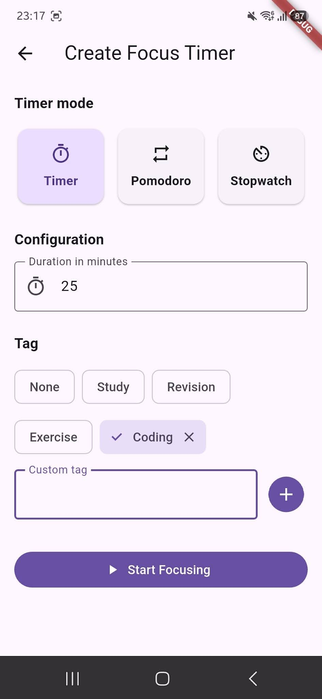</td>
        <td style="vertical-align: top;">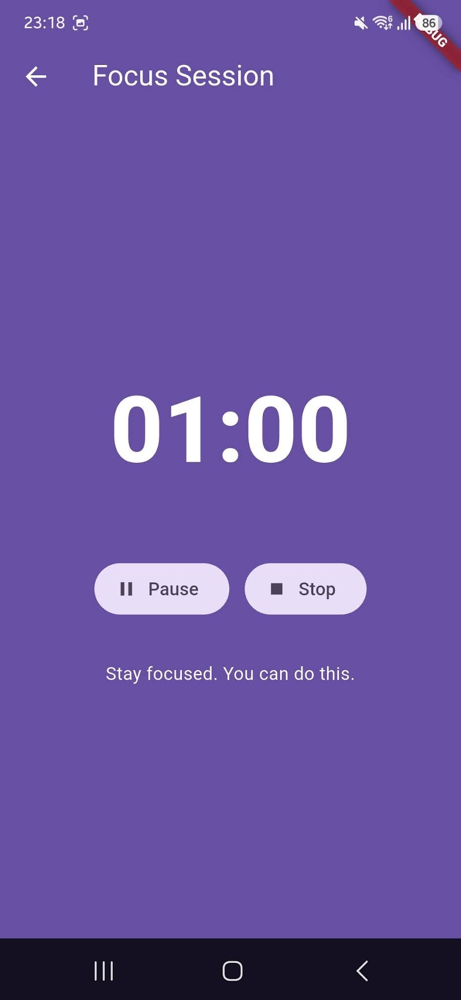</td>
        <td style="vertical-align: top;">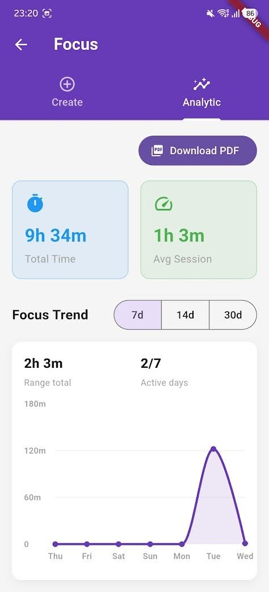</td>
    </tr>
    <tr>
        <td style="vertical-align: top;">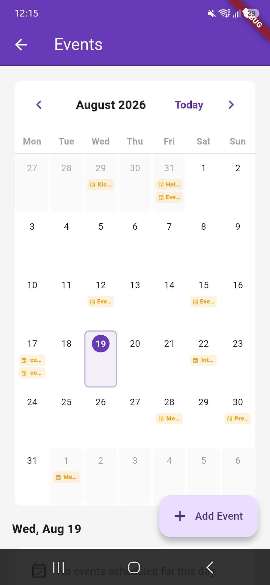</td>
        <td style="vertical-align: top;">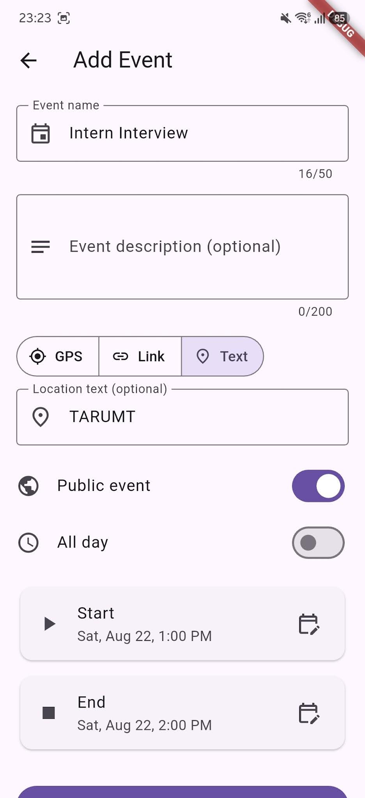</td>
        <td style="vertical-align: top;">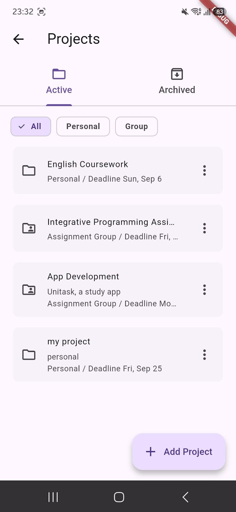</td>
        <td style="vertical-align: top;">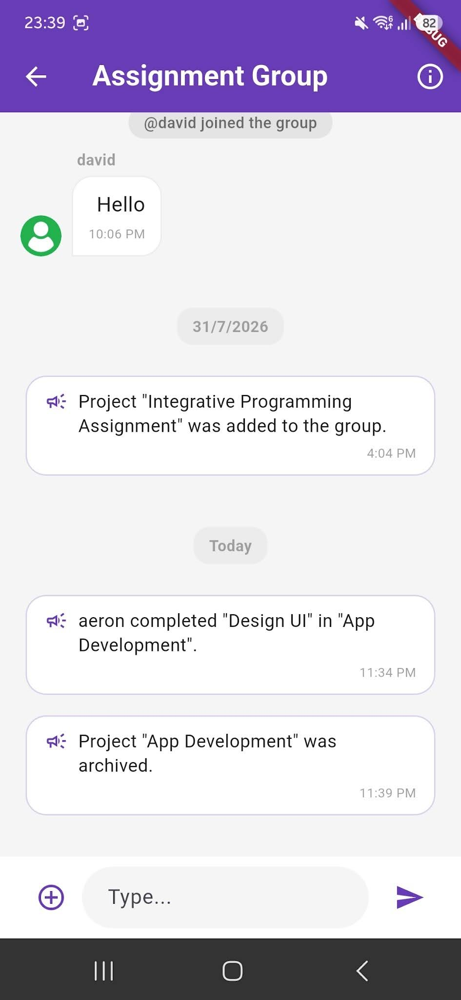</td>
    </tr>
    <tr>
        <td style="vertical-align: top;">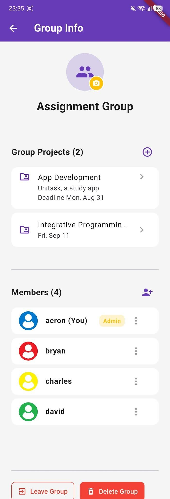</td>
        <td style="vertical-align: top;"></td>
        <td style="vertical-align: top;">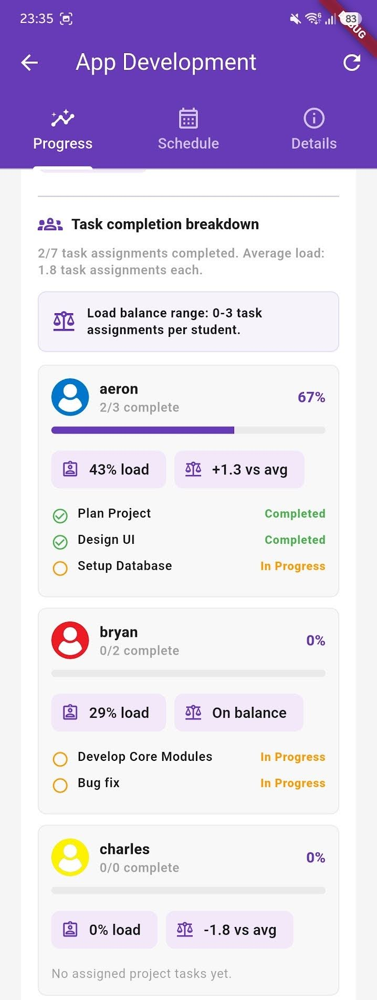</td>
        <td style="vertical-align: top;">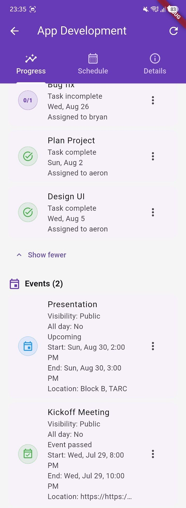</td>
    </tr>
    <tr>
        <td style="vertical-align: top;">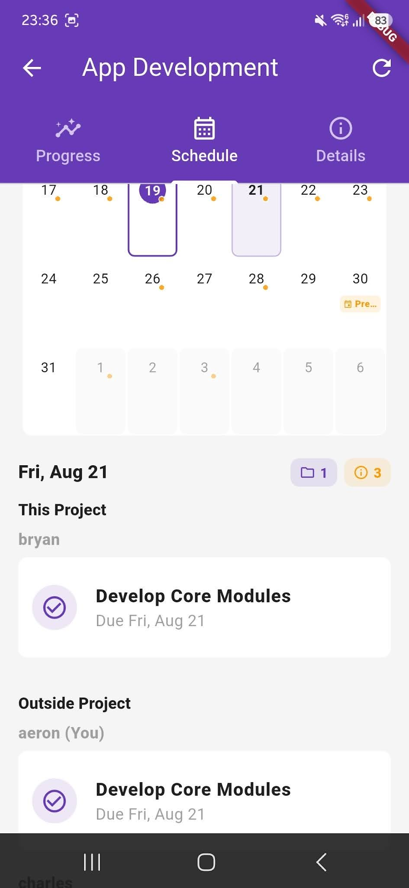</td>
        <td style="vertical-align: top;">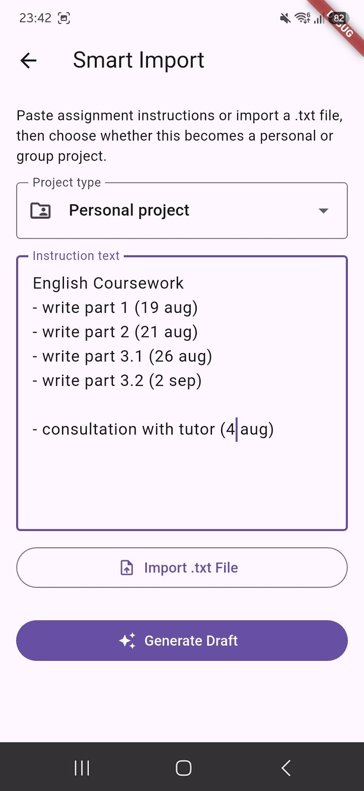</td>
        <td style="vertical-align: top;">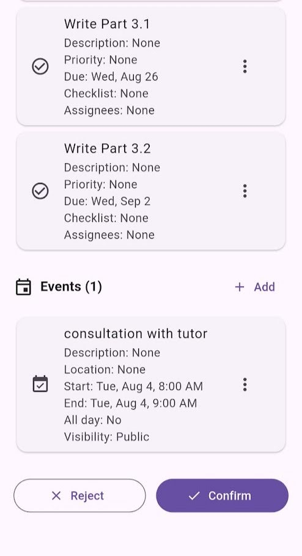</td>
        <td style="vertical-align: top;"></td>
    </tr>
</table>

---

[← Back to Portfolio](../README.md)